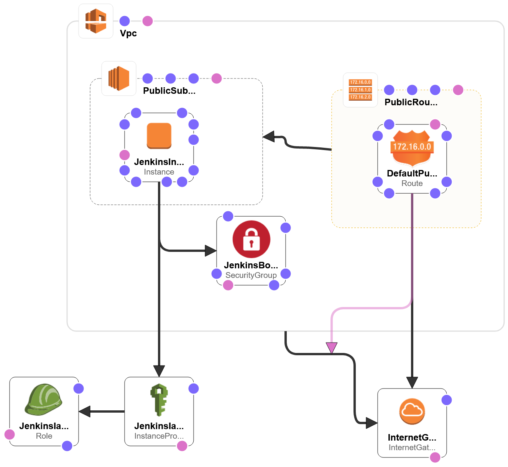
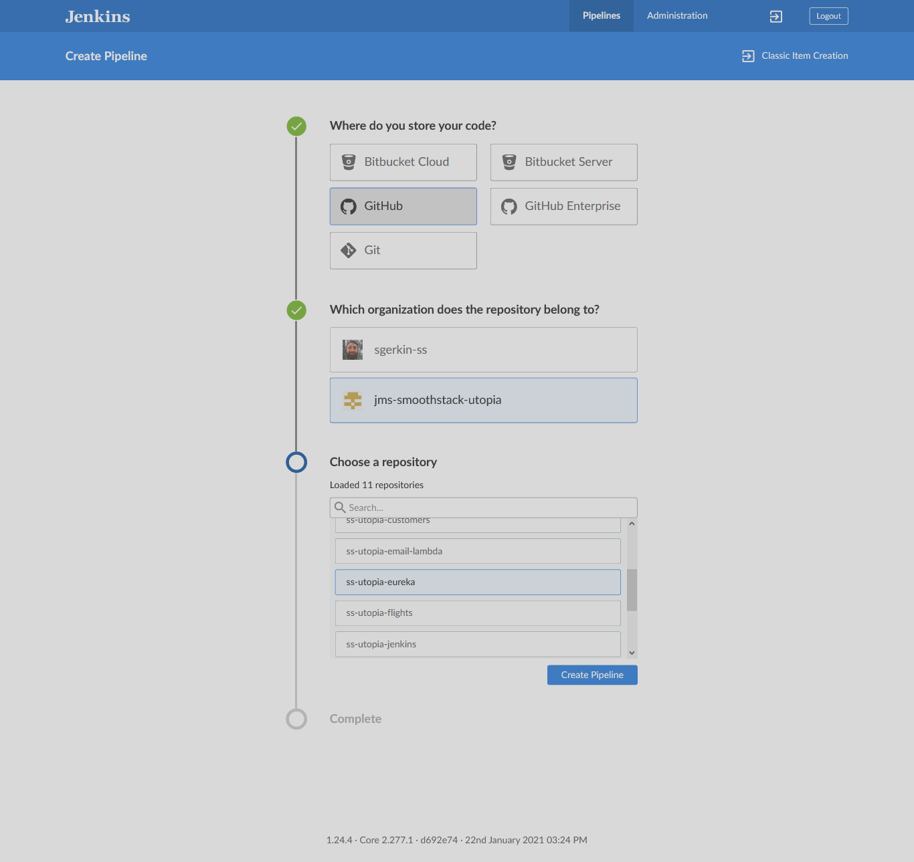
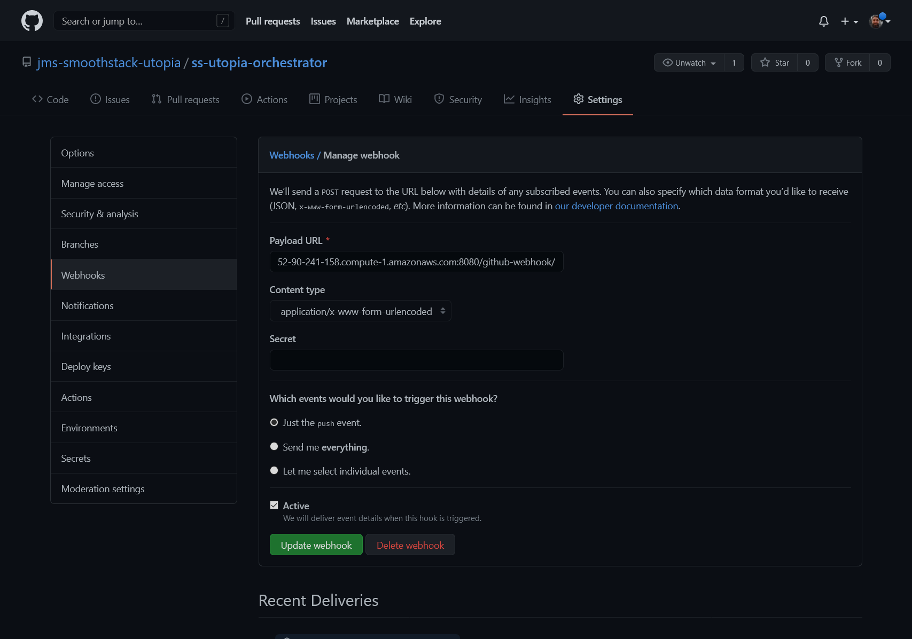

# Utopia - Jenkins CI
This repository contains all required elements for instantiating a fresh Jenkins continuous integration server with Sonarqube. This is currently deployed on AWS and available at [http://ec2-52-90-241-158.compute-1.amazonaws.com:8080](http://ec2-52-90-241-158.compute-1.amazonaws.com:8080). Additionally, Sonarqube reports can be accessed at [http://ec2-52-90-241-158.compute-1.amazonaws.com:9000](http://ec2-52-90-241-158.compute-1.amazonaws.com:9000).

For credentials, please contact [Stephen Gerkin](mailto:stephen.gerkin@smoothstack.com).

## AWS Infrastructure
The stack created for this instance is fully self-contained and provides its own VPC, Subnet, routing, and EC2 instance with CloudFormation. The template for this is available at [./jenkins-stack.yaml](./jenkins-stack.yaml). Not included in this repository are the parameters that provide SSH access to the EC2 instance. This can either be provided as a JSON file in `.secret/jenkins-params.json` to be run with the `create.ps1` script for creating a new CF stack, or provided during creation with the AWS CLI.

The template design creates the following stack:


## Creation
The [create.ps1](./create.ps1) file contains the AWS CLI command for creating a new stack. The stack name for this is hardcoded in the script and meant only as a reference for intial creation. If additional copies of this stack should be created, use the following command (substituting as necessary) in a bash terminal:
```sh
aws cloudformation create-stack \
  --stack-name ${STACK_NAME} \
  --region=us-east-1 \
  --template-body file://jenkins-stack.yaml \
  --parameters file://.secret/jenkins-params.json \
  --capabilities "CAPABILITY_IAM" "CAPABILITY_NAMED_IAM"
```
Or
```powershell
aws cloudformation create-stack `
  --stack-name $env:STACK_NAME `
  --region=us-east-1 `
  --template-body file://jenkins-stack.yaml `
  --parameters file://.secret/jenkins-params.json `
  --capabilities "CAPABILITY_IAM" "CAPABILITY_NAMED_IAM"
```

Both commands assume the presence of an included JSON file for the parameters that should be written as:
```json
[
  {
    "ParameterKey":"AccessCidr",
    "ParameterValue":"FULL CIDR FOR SSH ACCESS"
  },
  {
    "ParameterKey":"SSHKeyName",
    "ParameterValue":"EXISTING SSH KEY NAME"
  }
]
```

The stack uses a custom AMI that includes all Utopia projects as pipeline projects within Jenkins as of 2021-03-16. Future revisions of the AMI will need to be provided as a parameter to the stack. The keyname for this property is `ImageId` and can be included in the above mentioned JSON file:
```json
[
  {
    "ParameterKey":"ImageId",
    "ParameterValue":"ami-____"
  }
]
```

## Jenkins UI
The Jenkins instance includes an install of the Blue Ocean UI for simpler pipeline management. Additional pipelines can be included by entering the Blue Ocean UI and clicking `New Pipeline`. From there, follow the prompts as appropriate and click `Create Pipeline`:


Additionally, a webhook must be created on GitHub to allow it to push changes to the repository with a payload URL of `http://ec2-52-90-241-158.compute-1.amazonaws.com:8080/github-webhook/`


## Unconfigured Instance
For a fresh, unconfigured instance with no credentials initialized (useful for creating a new AMI) can be created with the included [userdata-unconfigured.sh](./userdata-unconfigured.sh) file. This will create a new Jenkins and Sonarqube instance with no configuration.

The userdata file additionally includes the creation of a service daemon that will automatically turn on Jenkins and Sonarqube should the instance be rebooted or stopped and restarted for any reason.

After creating an EC2 with the userdata file, SSH into the instance to get the initial admin password for Jenkins by executing
```sh
$ docker exec jenkins cat /var/jenkins_home/secrets/initialAdminPassword
```

Then open the Jenkins UI (on port 8080) to configure the instance with the username `admin` and the aforementioned password.

Sonarqube will also need administrative configuration and can be accessed with the default `admin:admin` username and password (on port 9000).

Once configured, a new AMI can be created from the configured settings and the [jenkins-stack.yaml](./jenkins-stack.yaml) template can be used with the new AMI ID.
